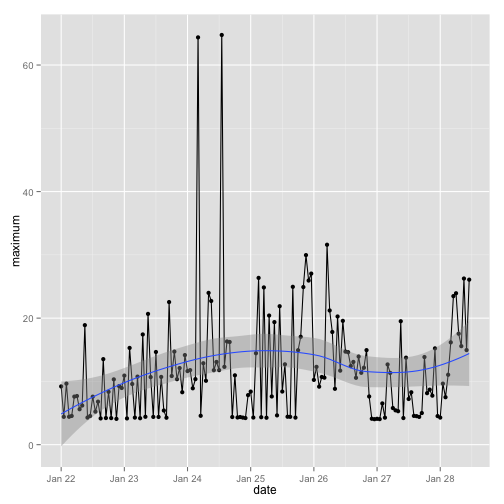

GoogleVis Chart

<!-- LineChart generated in R 3.1.1 by googleVis 0.5.10 package -->
<!-- Fri Jan 29 18:39:04 2016 -->

<!-- jsHeader -->

 
<!-- jsChart -->  

 
<!-- divChart -->
  

<!-- MotionChart generated in R 3.1.1 by googleVis 0.5.10 package -->
<!-- Fri Jan 29 18:39:04 2016 -->

<!-- jsHeader -->

 
<!-- jsChart -->  

 
<!-- divChart -->
  

ggplot2 Chart - Trend & Linear Regression 

